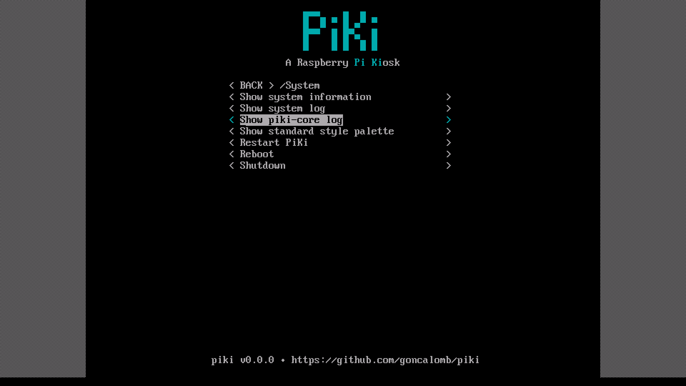
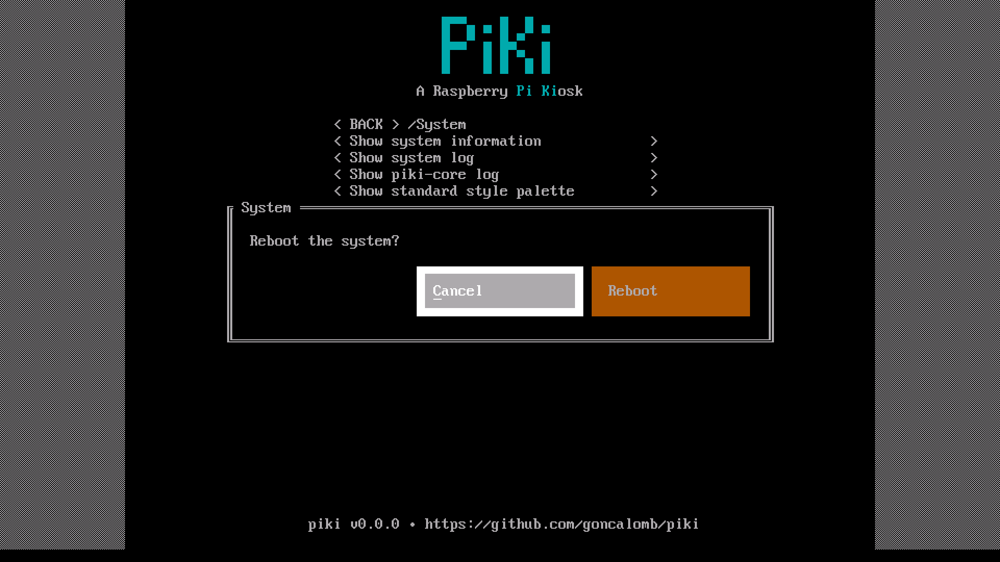

# PiKi: A Raspberry [Pi Ki]osk

PiKi is a system for creating and configuring kiosks-like setups on a Raspberry Pi.

It is meant to be installed using Ansible on a Raspberry Pi without GUI (lite), it includes a Python service with a text-based UI and plugin system to bootstrap simple applications and tasks.





## Who is this for?

PiKi is for creating systems that have a single purpose (kiosks), things like:

* a display that updates with some live data from the network
* a VLC-based video player (yes, VLC works on RPi without a graphical UI)
* a IR-receiver that triggers custom actions
* a system that interfaces to GPIO devices

Everything is possible, PiKi is just a way to pre-configure the Raspberry Pi to accept your application.

## Features

* ansible: configuration of simple systemd services
* ansible: kernel-level GPIO/RC configuration
* piki-core: built-in text-based user interface (using [urwid]), with a custom window manager
* piki-core: [asyncio] event loop setup
* piki-core: plugin system to run your own code directly on piki-core
* piki-core: IR-receiver configuration tool
* piki-core: ~~input event system to handle keyboard events~~ (IN PROGRESS)
* ansible: ~~GUI support, e.g. running a browser kiosk~~ (PLANNED, right now you can launch X/Wayland yourself)

## How does it work?

PiKi is meant to be installed in a fresh Raspberry OS Lite system.

0. Installs dependencies (apt)
0. Copies piki files to `/opt/piki` (by default)
0. Creates a venv
0. Installs python dependencies (pip3)
0. Configures kernel options (dtoverlay=)
0. Configures main python service (piki-core) on tty7
0. Installs user requested packages/plugins
0. Setups user requested systemd services
0. Starts piki-core (always starts on boot)

### piki-core

The piki-core is a console based application that runs connected to a tty (tty7 by default). It has a text-based UI using [urwid] and a plugin system to create your desired application (e.g. interface with GPIO, run subprocesses, request data from the network, handle input events, etc.).

Using piki-core plugins is very easy to bootstrap your application with a single python script.

The plugins have full control over the [urwid] UI.

## WIP

This project is a work-in-progress, more documentation will be available later. Here is some important pointers:

* no versioning ATM just v0.0.0
* use with a fresh Raspberry OS Lite system (no GUI), `piki-core` is a console application
* piki uses the default user `pi`, there is no way to configure another user ATM
* the plugin API module [`piki.plugin`](piki/piki/plugin.py) has some documentation (may no be final), plugins should not call code from the `piki.core` package (this is considered internal code)
* plugins need to be placed at `/opt/piki/plugins` (there's an ansible var to copy plugins)
* check the [internal plugins](piki/piki/core/plugins) for examples on how they work, more examples will be available later
* ansible vars are listed at [main.yaml](ansible-role/defaults/main.yaml), some vars are irreversible (e.g. if you install piki but then rerun the role a different `piki_dir` it will install piki again in the new location, without clearing the old one)
* a simplified installation script that does not require ansible knowledge will be provided later

## Example Ansible Setup

`requirements.yaml`

```yaml
roles:
  - name: goncalomb.piki
    src: git+https://github.com/goncalomb/piki.git
```

`inventory.yaml`

```yaml
all:
  hosts:
    192.168.1.1: # set your raspberry pi ip/hostname here
```

`playbook.yaml`

```yaml
- name: My PiKi Setup
  hosts: all
  remote_user: pi

  vars:
    piki_user_plugins_copy:
      - my-plugin.py

  tasks:
    - name: Install PiKi
      ansible.builtin.include_role:
        name: goncalomb.piki
```

`my-plugin.py`

```python
import urwid
from piki.plugin import Plugin


class MyPlugin(Plugin):
    def on_ui_create(self):
        def cb():
            self.ctl.ui_window_make(
                urwid.Filler(
                    urwid.Text('Hello world!', align='center')
                ),
                title='My Window',
                overlay={
                    'width': ('relative', 50),
                    'height': ('relative', 50),
                }
            )
        self.ctl.ui_menu_setup_root(buttons=[
            ('CLICK ME', cb),
        ])
```

Install piki role and run playbook:

```bash
ansible-galaxy install -fr requirements.yaml
ansible-playbook -i inventory.yaml playbook.yaml
```

[urwid]: https://urwid.org/
[asyncio]: https://docs.python.org/3/library/asyncio.html
